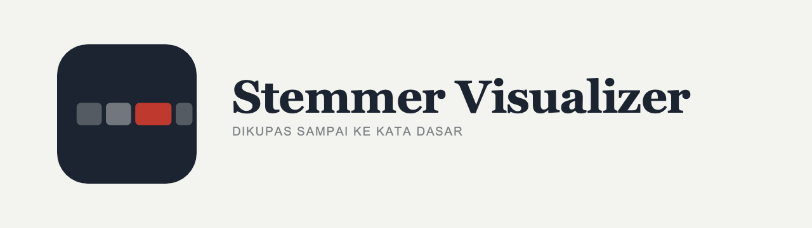

<div align="center">

<picture>
  <source media="(prefers-color-scheme: dark)" srcset="public/brand/lockup-dark.png">
  
</picture>

**Indonesian stemming, opened up.** Every rule that fired, every dictionary lookup,
every backtrack — and every root the word could plausibly have.

[**Open the app →**](https://andifathulms.github.io/stemmer-visualizer/)

[](https://github.com/andifathulms/stemmer-visualizer/actions/workflows/deploy.yml)


</div>

---

Search engines and language software strip affixes before they do anything else, so that
*mempelajari*, *pelajaran* and *belajar* are all recognised as the same word: **ajar**. Normally
that happens behind a closed door — word in, answer out. This opens it one layer at a time,
including the times it gets the answer wrong.

```
mempelajari  →  ajar

  mem-   awalan      peeled off
  pel-   awalan      peeled off
  -i     akhiran     peeled off
  ajar   kata dasar  what's left standing
```

## Why bother opening it

**When it's wrong, the wrongness is invisible.** A bad result is still a plausible-looking string.
Without seeing which rule fired and which lookup succeeded, a wrong answer and a right one are
equally convincing.

**The answer depends on the dictionary, not only the rules.** The algorithm checks a list of roots
at nearly every step. Swap the list and the answer changes — so here the list is visible, editable,
and one click away from breaking on purpose.

**More than one answer is often correct.** *Beruang* reads as `ber-` + *uang*, or as the root
*beruang*. No amount of rule refinement settles it. Most implementations pick one and say nothing.
This one enumerates them and reports that a choice was made.

## What's here

| Page | |
|---|---|
| [`/id/kupas`](https://andifathulms.github.io/stemmer-visualizer/id/kupas/) | The trace: morpheme boundaries, steps as ruled lines, step-through, backtracks struck through rather than erased. |
| [`/id/kandidat`](https://andifathulms.github.io/stemmer-visualizer/id/kandidat/) | Every admissible segmentation as a tree, dictionary-valid leaves marked, the chosen path highlighted with its reason. |
| [`/id/kamus`](https://andifathulms.github.io/stemmer-visualizer/id/kamus/) | The dictionary as an editable input, with per-word provenance. Edits ride in the URL hash. |
| [`/id/aturan`](https://andifathulms.github.io/stemmer-visualizer/id/aturan/) | All 44 rules with pattern, readings, precedence, example and citation. |
| [`/id/galeri`](https://andifathulms.github.io/stemmer-visualizer/id/galeri/) | Six words the algorithm gets wrong, recomputed live so entries cannot go stale. |
| [`/id/dokumen`](https://andifathulms.github.io/stemmer-visualizer/id/dokumen/) | Paste text; roots, plus flags for multi-candidate and unmatched words. |

Indonesian first, English throughout. Static export, no backend, no accounts — state shares by URL.

## This is not Sastrawi

[Sastrawi](https://github.com/sastrawi/sastrawi) is the production library for Indonesian stemming,
and it is what you should use in a pipeline. This is a personal, educational implementation of the
published papers. It makes its own choices, it can be wrong, and where it diverges those divergences
are investigated, classified and published rather than papered over. **No parity with Sastrawi is
claimed.**

Sastrawi appears two ways, neither at runtime: as a differential **oracle** in a development-only
script, and as the source of the shipped root list (MIT, redistributed with its notice). No Sastrawi
code ships, and `lib/` imports nothing from it.

### What the oracle found

315 words compared against PySastrawi. 309 agreed. Of the six that didn't, **three turned out to be
dictionary artefacts rather than rule differences** — including one that had been *misclassified*.
`mengupas` was filed as genuine ambiguity, on the claim that Sastrawi has both `upas` and `kupas` as
roots. It doesn't: Sastrawi ships two word lists, and only the one it *doesn't* load contains
`upas`. Whoever recorded that entry checked the wrong file.

The three that survive — `terpercaya`, `bertemu`, `menyanyi` — don't move when the dictionary
changes, which is positive evidence that they're rule-level and that the papers are what settle
them.

The write-up is in [`tests/oracle/divergences.md`](tests/oracle/divergences.md), and every
classification is pinned by an assertion so the prose can't quietly rot.

> A differential oracle that finds nothing has usually just confirmed that both sides copied the
> same secondary source.

## Rule verification status

Every rule in `data/rules/` carries a `verification` field:

| Value | Meaning |
|---|---|
| `verified` | Checked line-by-line against the cited table or rule in the source paper. |
| `unverified` | Reconstructed from the widely-published form of the algorithm. The citation points at where it *should* be checked; nobody has checked it yet. |

**All 44 rules currently ship `unverified`.** They're marked as such in the data, surfaced in the
rule reference UI, and the validator refuses any rule missing the field. Do not treat an
`unverified` rule as sourced. All three source papers are paywalled or gone — see the
source-availability table in [`data/rules/GAPS.md`](data/rules/GAPS.md) before going looking.

## How it's built

Next.js 14 static export · TypeScript `strict` · Tailwind · Zod · Vitest · pnpm. No stemming,
morphology or NLP dependency.

The constraints are the interesting part, and they're enforced rather than encouraged:

- **No stemming rule lives in application code.** Rules are data in `data/rules/`, each with an id,
  pattern, precedence and citation; the engine is an interpreter. This exists so a linguist who
  doesn't code can audit the rule set — and the build fails on a rule without a citation.
- **The dictionary is an explicit parameter**, never a module import and never a singleton. That is
  what lets the panel swap it at runtime and the tests swap it freely.
- **One rule set, two traversals.** `interpret.ts` follows precedence and returns the algorithm's
  answer; `enumerate.ts` explores every admissible segmentation. The rule data is never forked.
- **Backtracks are recorded, never erased.** The search being visible as a search is the product.
- **The engine is pure** — no clock, no randomness, no DOM. Byte-identical trace for identical input.

```
lib/engine/          the core — interpreter, enumeration, recoding, prefix types, trace
lib/rules/           schema, loader, build-time validator
data/rules/          the rule packs themselves
data/dictionary/     base.json (293, hand-curated) · sastrawi.json (~30k, MIT)
tests/               papers · oracle · properties · ambiguity
```

Conventions in [`CLAUDE.md`](CLAUDE.md); scope and design direction in [`PRD.md`](PRD.md).

## Development

```bash
pnpm install
pnpm dev                  # http://localhost:3000
pnpm build                # static export to ./out; runs rules:validate first
pnpm preview              # serve ./out under the production basePath

pnpm test:run             # vitest once — before every commit
pnpm test:papers          # worked examples from the source papers
pnpm test:oracle          # differential comparison against recorded Sastrawi fixtures
pnpm test:properties      # idempotence, enumeration soundness, dictionary independence
pnpm rules:validate       # schema, citations, precedence conflicts
```

Two scripts are development-only, never run in CI, and never ship in the browser bundle:
`pnpm fixtures:record` re-records the oracle fixtures, and `pnpm dictionary:import` regenerates the
root list. Both need PySastrawi installed locally.

## Sources

- Nazief, B. & Adriani, M. (1996). *Confix-Stripping: Approach to Stemming Algorithm for Bahasa
  Indonesia.* Fakultas Ilmu Komputer, Universitas Indonesia.
- Asian, J., Williams, H. E. & Tahaghoghi, S. M. M. (2005). *Stemming Indonesian.* Proceedings of
  the 28th Australasian Computer Science Conference, CRPIT vol. 38, pp. 307–314.
- Adriani, M., Asian, J., Nazief, B., Tahaghoghi, S. M. M. & Williams, H. E. (2007). *Stemming
  Indonesian: A confix-stripping approach.* ACM TALIP 6(4).
  [doi:10.1145/1316457.1316459](https://doi.org/10.1145/1316457.1316459) — the extended journal
  version, and the most complete published statement of the rule table.

## Licence

MIT — see [`LICENSE`](LICENSE).

The shipped root list is redistributed from [Sastrawi](https://github.com/sastrawi/sastrawi) under
the MIT licence, and the notice travels with it in
[`data/dictionary/LICENCE-sastrawi.txt`](data/dictionary/LICENCE-sastrawi.txt). Dictionary entries
carry per-entry provenance.

---

<div align="center">

Designed &amp; built by [**Andi Fathul Mukminin**](https://andifathulms.github.io/en/)

[Portfolio](https://andifathulms.github.io/en/) ·
[GitHub](https://github.com/andifathulms) ·
[LinkedIn](https://www.linkedin.com/in/andifathulmukminin/) ·
[Instagram](https://www.instagram.com/andifathulms/)

</div>
